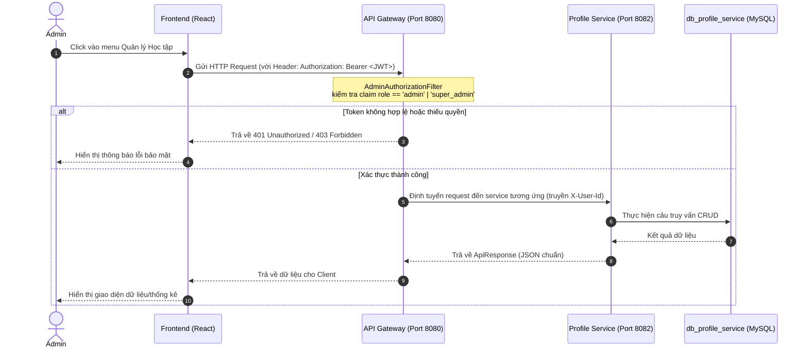

# Tài liệu Thiết kế & Quy trình Tích hợp API Quản lý Học tập (Admin)

Tài liệu này mô tả chi tiết quy trình thực hiện từ Backend đến Frontend để tích hợp các tính năng Quản lý Học tập của Admin (Môn học, Chương trình đào tạo, Niên khóa, Học kỳ, và Hồ sơ học tập).

---

## I. Sơ đồ Kiến trúc & Luồng xử lý (Data Flow)



---

## II. Quy trình Thực hiện chi tiết

### Bước 1: Cấu hình API Gateway
Để cho phép các API Admin từ client đi qua Gateway đến `profile-service`, ta cập nhật file [application.properties](file:///d:/studymatch/backend/api-gateway/src/main/resources/application.properties):

1. Tìm route `profile-service-route`.
2. Thêm các mẫu đường dẫn Admin vào predicates:
```properties
spring.cloud.gateway.routes[1].id=profile-service-route
spring.cloud.gateway.routes[1].uri=${PROFILE_SERVICE_URL:lb://PROFILE-SERVICE}
spring.cloud.gateway.routes[1].predicates[0]=Path=/api/onboarding/**,/api/cohorts/**,/api/subjects/**,/api/academic-terms/**,/api/profile/**,/api/admin/subjects/**,/api/admin/cohorts/**,/api/admin/academic-terms/**,/api/admin/curriculums/**,/api/admin/profiles/**
```

---

### Bước 2: Thiết lập Backend (BE - `profile_service`)

Tất cả các API phản hồi chuẩn theo cấu trúc Common Envelope Response:
```json
{
  "success": true,
  "code": "SUCCESS",
  "message": "Thông báo thành công",
  "data": { ... }
}
```

#### 2.1 Quản lý Môn học (Subjects)
*Controller: `AdminSubjectController.java` | Path: `/api/admin/subjects`*

*   **API 1: Lấy danh sách môn học (Phân trang & Tìm kiếm)**
    *   **Method:** `GET`
    *   **Query Params:** `page` (int, default 0), `size` (int, default 10), `search` (string - tìm kiếm theo tên hoặc mã môn học).
    *   **Response (success):**
        ```json
        {
          "success": true,
          "code": "SUCCESS",
          "message": "Lấy danh sách môn học thành công",
          "data": {
            "content": [
              {
                "subjectId": 1,
                "subjectCode": "200101",
                "subjectName": "Triết học Mác Lênin"
              }
            ],
            "totalElements": 75,
            "totalPages": 8,
            "size": 10,
            "number": 0
          }
        }
        ```

*   **API 2: Thêm mới môn học**
    *   **Method:** `POST`
    *   **Request Body:**
        ```json
        {
          "subjectCode": "214495",
          "subjectName": "Lập trình hướng thiết bị di động nâng cao"
        }
        ```
    *   **Response:** Trả về đối tượng môn học vừa tạo.

*   **API 3: Cập nhật môn học**
    *   **Method:** `PUT`
    *   **URL:** `/api/admin/subjects/{subjectId}`
    *   **Request Body:**
        ```json
        {
          "subjectCode": "214495",
          "subjectName": "Lập trình di động Flutter (Nâng cao)"
        }
        ```

*   **API 4: Xóa môn học**
    *   **Method:** `DELETE`
    *   **URL:** `/api/admin/subjects/{subjectId}`
    *   *Lưu ý:* Cần kiểm tra bảng `curriculum_term_subjects` và `student_subject_enrollments` trước khi xóa. Nếu đã có dữ liệu ràng buộc thì ném lỗi `StatusCode.BAD_REQUEST` với thông điệp: `"Môn học đã tồn tại trong chương trình đào tạo hoặc có sinh viên đăng ký học, không thể xóa."`

*   **API 5: Import môn học hàng loạt**
    *   **Method:** `POST`
    *   **URL:** `/api/admin/subjects/import`
    *   **Request Body (JSON array):**
        ```json
        [
          { "subjectCode": "MATH101", "subjectName": "Toán giải tích" },
          { "subjectCode": "PHY102", "subjectName": "Vật lý đại cương" }
        ]
        ```

---

#### 2.2 Quản lý Chương trình Đào tạo (Curriculums)
*Controller: `AdminCurriculumController.java` | Path: `/api/admin/curriculums`*

*   **API 1: Lấy danh sách chương trình**
    *   **Method:** `GET`
    *   **Response:** Trả về mảng danh sách từ bảng `curriculums`.

*   **API 2: Tạo mới chương trình**
    *   **Method:** `POST`
    *   **Request Body:**
        ```json
        {
          "curriculumCode": "CTDT_K50_CNTT",
          "curriculumName": "Chương trình đào tạo CNTT khóa 50 (bắt đầu 2024)"
        }
        ```

*   **API 3: Gán môn học vào chương trình**
    *   **Method:** `POST`
    *   **URL:** `/api/admin/curriculums/{curriculumId}/subjects`
    *   **Request Body:**
        ```json
        {
          "studyYearNo": 1,
          "semesterNo": 1,
          "subjectId": 5,
          "isRequired": true,
          "recommendedOrder": 1
        }
        ```

*   **API 4: Gỡ môn học khỏi chương trình**
    *   **Method:** `DELETE`
    *   **URL:** `/api/admin/curriculums/{curriculumId}/subjects/{subjectId}`

---

#### 2.3 Quản lý Khóa học (Cohorts)
*Controller: `AdminCohortController.java` | Path: `/api/admin/cohorts`*

*   **API 1: Lấy danh sách khóa**
    *   **Method:** `GET`
    *   **Response Data:**
        ```json
        [
          {
            "cohortId": 1,
            "cohortCode": "48",
            "startAcademicYear": 2022,
            "totalStudyYears": 4,
            "curriculum": {
              "curriculumId": 1,
              "curriculumCode": "CTDT_K48_CNTT",
              "curriculumName": "Chương trình đào tạo CNTT khóa 48"
            }
          }
        ]
        ```

*   **API 2: Thêm mới khóa**
    *   **Method:** `POST`
    *   **Request Body:**
        ```json
        {
          "cohortCode": "50",
          "startAcademicYear": 2024,
          "totalStudyYears": 4,
          "curriculumId": 2
        }
        ```

---

#### 2.4 Cài đặt Học kỳ (Academic Terms)
*Controller: `AdminAcademicTermController.java` | Path: `/api/admin/academic-terms`*

*   **API 1: Tạo mới học kỳ**
    *   **Method:** `POST`
    *   **Request Body:**
        ```json
        {
          "academicYearStart": 2026,
          "academicYearEnd": 2027,
          "semesterNo": 1,
          "fullName": "Học kỳ 1 - Năm học 2026 - 2027",
          "status": "planned" // planned, active, completed
        }
        ```

*   **API 2: Kích hoạt học kỳ hiện tại**
    *   **Method:** `PUT`
    *   **URL:** `/api/admin/academic-terms/{termId}/active`
    *   *Logic xử lý BE:*
        1. Tìm học kỳ theo `termId`, đổi trạng thái sang `"active"`.
        2. Tự động tìm học kỳ đang `"active"` trước đó, chuyển trạng thái thành `"completed"`.
        3. Lưu lại các thay đổi vào database.

---

#### 2.5 Xem & Quản lý Hồ sơ học tập (Profiles)
*Controller: `AdminProfileController.java` | Path: `/api/admin/profiles`*

*   **API 1: Danh sách hồ sơ sinh viên**
    *   **Method:** `GET`
    *   **Query Params:** `page`, `size`, `search` (tìm theo tên, mã sinh viên), `cohortId` (lọc theo khóa).
    *   **Response:** Trả về danh sách sinh viên kèm thông tin niên khóa.

*   **API 2: Thống kê tổng hợp học tập (Stats Overview)**
    *   **Method:** `GET`
    *   **URL:** `/api/admin/profiles/stats`
    *   **Response Data:**
        ```json
        {
          "totalStudentsCount": 1250,
          "studentsPerCohort": {
            "K46": 300,
            "K47": 310,
            "K48": 320,
            "K49": 320
          },
          "topEnrolledSubjects": [
            { "subjectName": "Lập trình cơ bản", "enrollmentCount": 450 },
            { "subjectName": "Cấu trúc dữ liệu", "enrollmentCount": 380 }
          ],
          "studentsByRegion": {
            "Miền Nam": 800,
            "Miền Trung": 250,
            "Miền Bắc": 200
          }
        }
        ```

---

## III. Thiết lập Frontend (FE - React)

### Bước 1: Điều chỉnh Sidebar
Cập nhật [StudyMatchAdminLayout.tsx](file:///d:/studymatch/frontend/src/layouts/admin/StudyMatchAdminLayout.tsx) theo thiết kế Dropdown:

1. Import `useState` và các icon cần thiết (`GraduationCap`, `ChevronDown`, `Library`, `CalendarDays`).
2. Khai báo state đóng/mở dropdown: `const [isAcademicOpen, setIsAcademicOpen] = useState(false);`
3. Thêm cấu trúc HTML menu con dưới mục **Người dùng** (xem mã code cụ thể ở phần đề xuất trước).

---

### Bước 2: Thiết lập Routes mới
Cập nhật file cấu hình Router (thường là `App.tsx` hoặc `index.tsx` bên dưới thư mục `/routes/`):

```tsx
import { AcademicProfilesPage } from "./pages/admin/AcademicProfilesPage";
import { AcademicSubjectsPage } from "./pages/admin/AcademicSubjectsPage";
import { AcademicCurriculumsPage } from "./pages/admin/AcademicCurriculumsPage";
import { AcademicCohortsPage } from "./pages/admin/AcademicCohortsPage";
import { AcademicTermsPage } from "./pages/admin/AcademicTermsPage";

// ... Trong phần Route của Admin Layout:
<Route path="/admin" element={<StudyMatchAdminLayout />}>
  <Route path="overview" element={<AdminOverviewPage />} />
  
  {/* Các Route quản lý học tập mới bổ sung */}
  <Route path="profiles" element={<AcademicProfilesPage />} />
  <Route path="curriculums" element={<AcademicCurriculumsPage />} />
  <Route path="subjects" element={<AcademicSubjectsPage />} />
  <Route path="cohorts" element={<AcademicCohortsPage />} />
  <Route path="academic-terms" element={<AcademicTermsPage />} />
  
  {/* ... Các route cũ ... */}
</Route>
```

---

### Bước 3: Viết Services gọi API từ Frontend
Tạo file dịch vụ kết nối `/services/AdminAcademicService.ts`:

```typescript
import axios from "axios";

const API_BASE_URL = "http://localhost:8080/api/admin"; // Đi qua API Gateway

// Cấu hình axios instance để tự động đính kèm Token
const getAuthConfig = () => {
  const token = localStorage.getItem("accessToken");
  return {
    headers: {
      Authorization: `Bearer ${token}`
    }
  };
};

// API Môn học
export const getAdminSubjects = async (page: number, size: number, search: string) => {
  const response = await axios.get(
    `${API_BASE_URL}/subjects?page=${page}&size=${size}&search=${search}`, 
    getAuthConfig()
  );
  return response.data;
};

export const createSubject = async (subjectData: { subjectCode: string; subjectName: string }) => {
  const response = await axios.post(`${API_BASE_URL}/subjects`, subjectData, getAuthConfig());
  return response.data;
};

export const updateSubject = async (subjectId: number, subjectData: { subjectCode: string; subjectName: string }) => {
  const response = await axios.put(`${API_BASE_URL}/subjects/${subjectId}`, subjectData, getAuthConfig());
  return response.data;
};

export const deleteSubject = async (subjectId: number) => {
  const response = await axios.delete(`${API_BASE_URL}/subjects/${subjectId}`, getAuthConfig());
  return response.data;
};

export const importSubjects = async (subjectsList: any[]) => {
  const response = await axios.post(`${API_BASE_URL}/subjects/import`, subjectsList, getAuthConfig());
  return response.data;
};

// Các API cho các thực thể còn lại viết tương tự...
```

---

### Bước 4: Xây dựng Giao diện Trang quản trị

Mỗi trang sẽ có cấu trúc UI chuẩn hóa bằng Tailwind CSS của hệ thống. Dưới đây là mô tả chi tiết quy trình xây dựng cho từng trang:

---

#### 4.1 Trang 1: AcademicSubjectsPage (Quản lý Danh mục Môn học)
*   **Giao diện chính:**
    1.  **Header:** Tiêu đề "Quản lý Môn học". Có 2 nút hành động chính bên góc phải: `+ Thêm môn học` (mở Modal thêm mới) và `📥 Import dữ liệu` (mở Modal import Excel/CSV/JSON).
    2.  **Thanh tìm kiếm (Filter):** Ô nhập liệu tìm kiếm theo Mã môn học hoặc Tên môn học. Áp dụng debounce thời gian trễ 300ms trước khi gọi `getAdminSubjects` để tránh gửi liên tục request lên server.
    3.  **Bảng dữ liệu (Table):**
        *   Các cột: `STT`, `Mã môn học` (subjectCode), `Tên môn học` (subjectName), `Hành động` (Sửa, Xóa).
        *   Hàng trống: Hiển thị hình ảnh minh họa trống và dòng chữ "Không tìm thấy môn học nào" nếu danh sách trả về rỗng.
    4.  **Thanh phân trang (Pagination):** Hiển thị tổng số bản ghi, nút sang trang Trước/Sau và dropdown chọn số lượng bản ghi hiển thị trên trang (`10`, `25`, `50`).
*   **Các Modal chức năng:**
    *   **Modal Thêm/Sửa Môn học:** Sử dụng `react-hook-form` để validate:
        *   `subjectCode`: Bắt buộc nhập, độ dài từ 2-20 ký tự.
        *   `subjectName`: Bắt buộc nhập, độ dài từ 2-150 ký tự.
        *   Nút gửi: Hiện trạng thái loading khi đang xử lý lưu. Thông báo bằng Toast thành công/thất bại.
    *   **Modal Import Môn học:** Có ô chọn tệp tin hoặc Textarea để dán chuỗi JSON danh sách môn học. Sau khi bấm "Xác nhận import", gửi danh sách lên API `/subjects/import`, hiển thị Toast thông báo số lượng môn học import thành công.
    *   **Xử lý Xóa môn học:** Khi bấm Xóa, hiển thị Dialog xác nhận. Nếu API trả về lỗi ràng buộc (do môn học đã được gán vào chương trình hoặc có sinh viên đăng ký học), bắt exception và hiển thị Toast cảnh báo màu đỏ với thông báo lỗi từ Backend.

---

#### 4.2 Trang 2: AcademicCurriculumsPage (Quản lý Chương trình Đào tạo)
*   **Giao diện chính (Layout 2 cột song song - Split View):**
    1.  **Cột bên trái (Danh sách Chương trình học - Chiếm 1/3 chiều rộng):**
        *   Hiển thị danh sách các chương trình đào tạo hiện có dưới dạng thẻ bài (Card) hoặc danh sách hàng.
        *   Mỗi dòng có tiêu đề, mã chương trình, nút Sửa nhanh và Xóa nhanh.
        *   Dưới cùng cột là nút `+ Thêm chương trình mới`.
        *   Bấm vào một dòng chương trình sẽ kích hoạt trạng thái `selectedCurriculumId` để load dữ liệu môn học ở cột bên phải.
    2.  **Cột bên phải (Chi tiết Môn học theo Lộ trình - Chiếm 2/3 chiều rộng):**
        *   Tiêu đề hiển thị tên chương trình đang chọn.
        *   Dữ liệu được tổ chức dạng **Grid** hoặc **Accordion** nhóm theo từng Năm học (Năm 1, Năm 2...) và từng Học kỳ (Học kỳ 1, Học kỳ 2).
        *   Trong mỗi học kỳ con, hiển thị danh sách các môn học đã được gán (Mã môn, Tên môn, Tag chỉ định `Bắt buộc` hoặc `Tự chọn`).
        *   Góc phải tiêu đề mỗi học kỳ có nút màu xanh `+ Gán môn học`.
        *   Mỗi dòng môn học có nút biểu tượng thùng rác màu đỏ để gỡ bỏ môn học khỏi lộ trình (gọi `removeSubjectFromCurriculum`).
*   **Các Modal chức năng:**
    *   **Modal Thêm/Sửa Chương trình:** Nhập `curriculumCode` và `curriculumName`.
    *   **Modal Gán môn học vào Học kỳ:**
        *   Dropdown tìm kiếm & chọn môn học (lấy dữ liệu từ tất cả môn học của hệ thống).
        *   Dropdown chọn Năm học (1, 2, 3, 4).
        *   Dropdown chọn Học kỳ (1, 2, 3).
        *   Checkbox: `Môn học bắt buộc` (isRequired).
        *   Input số: `Thứ tự đề xuất` (recommendedOrder).

---

#### 4.3 Trang 3: AcademicCohortsPage (Quản lý Khóa học)
*   **Giao diện chính:**
    1.  **Header:** Tiêu đề "Quản lý Khóa học", nút hành động `+ Thêm khóa học`.
    2.  **Bảng dữ liệu (Table):**
        *   Các cột: `STT`, `Tên khóa` (cohortCode - Ví dụ: "48"), `Năm học bắt đầu` (startAcademicYear - Ví dụ: 2022), `Thời gian đào tạo (Năm)` (totalStudyYears), `Chương trình đào tạo áp dụng` (curriculumName - liên kết từ object Curriculum), `Hành động` (Sửa, Xóa).
*   **Các Modal chức năng:**
    *   **Modal Thêm/Sửa Khóa học:**
        *   `cohortCode`: Bắt buộc nhập (Ví dụ: "48", "49").
        *   `startAcademicYear`: Dropdown chọn năm bắt đầu hoặc ô số (Ví dụ: 2023).
        *   `totalStudyYears`: Dropdown số năm học (Mặc định: 4).
        *   `curriculumId`: Dropdown danh sách chương trình đào tạo để gán cho khóa học này (gọi API `getAdminCurriculums` để đổ dữ liệu vào thẻ Select).
    *   **Xử lý Xóa khóa:** Bấm xóa sẽ gửi yêu cầu lên BE. Nếu khóa học đã có dữ liệu sinh viên trong hệ thống gắn liền với `cohort_id`, BE chặn lại và hiển thị cảnh báo Toast báo lỗi.

---

#### 4.4 Trang 4: AcademicTermsPage (Cài đặt Học kỳ)
*   **Giao diện chính:**
    1.  **Header:** Tiêu đề "Cài đặt Học kỳ", nút hành động `+ Tạo học kỳ mới`.
    2.  **Bảng dữ liệu (Table):**
        *   Các cột: `Tên học kỳ` (fullName), `Năm học` (academicYearStart - academicYearEnd), `Học kỳ số` (semesterNo), `Trạng thái` (status), `Hành động` (Cập nhật, Kích hoạt học kỳ hiện tại).
        *   Cột trạng thái sử dụng Badge Tailwind CSS có màu để phân biệt:
            *   `active` (Đang hoạt động): Badge màu Xanh lá cây (Green).
            *   `planned` (Dự kiến): Badge màu Xanh dương (Blue).
            *   `completed` (Đã kết thúc): Badge màu Xám (Slate).
*   **Hành động đặc biệt - Kích hoạt Học kỳ:**
    *   Kế bên nút sửa, các học kỳ có trạng thái khác `active` sẽ hiển thị thêm nút `Kích hoạt kỳ này` (nổi bật bằng màu xanh dương viền hoặc icon Switch).
    *   Khi click, hiển thị Dialog xác nhận: `"Bạn có chắc chắn muốn đặt học kỳ này làm Học kỳ hiện tại của hệ thống? Học kỳ đang hoạt động khác sẽ tự động được đánh dấu là Đã kết thúc."`
    *   Sau khi Admin bấm xác nhận, gọi API `/api/admin/academic-terms/{termId}/active`, tải lại danh sách học kỳ để cập nhật trạng thái Badge lập tức.
*   **Modal chức năng:**
    *   **Modal Thêm/Sửa Học kỳ:** Nhập các thông tin `academicYearStart`, `academicYearEnd`, `semesterNo` (1, 2 hoặc 3), `fullName` (Ví dụ: Học kỳ 1 - Năm học 2026 - 2027) và trạng thái mặc định (`planned`).

---

#### 4.5 Trang 5: AcademicProfilesPage (Quản lý Hồ sơ học tập)
*   **Giao diện chính:**
    1.  **Header:** Tiêu đề "Hồ sơ Học tập Sinh viên".
    2.  **Thanh bộ lọc (Filters Panel):**
        *   Ô tìm kiếm Sinh viên (nhập Mã sinh viên hoặc Tên đầy đủ).
        *   Dropdown chọn Khóa học (cohortId) - tự động gọi API `getAdminCohorts` để hiển thị danh sách các khóa có sẵn (46, 47, 48, 49) để lọc nhanh sinh viên theo khóa.
    3.  **Bảng dữ liệu (Table):**
        *   Các cột: `Mã sinh viên` (studentCode), `Họ và tên` (fullName), `Khóa` (cohortCode), `Khu vực` (region), `Giới tính` (gender), `Hành động` (Xem chi tiết, Hiệu chỉnh).
*   **Các Modal chức năng:**
    *   **Modal Xem chi tiết hồ sơ học tập (Detail Drawer/Modal):**
        *   Hiển thị thông tin tổng quan của sinh viên dạng Grid (ảnh đại diện, tên, MSSV, khóa học, vùng miền, giới tính, nhóm tuổi).
        *   **Danh sách môn học đang ký học học kỳ này:** Truy vấn từ thông tin enrollments môn học hiển thị dưới dạng tag các môn học sinh viên đang tham gia ghép cặp ở kỳ hiện tại.
        *   **Lịch sử học tập qua các kỳ (Student Term Profiles):** Hiển thị bảng/lưới điểm trung bình (GPA) và số tín chỉ đã tích lũy của sinh viên qua từng kỳ học từ dữ liệu `student_term_profiles` (Ví dụ: Học kỳ 1 - 2025-2026: GPA 3.4, Tích lũy 15 tín chỉ).
    *   **Modal Hiệu chỉnh hồ sơ:** Cho phép Admin sửa thông tin MSSV, họ tên, khu vực, giới tính hoặc thay đổi khóa học (`cohortId`) của sinh viên nếu sinh viên chuyển khóa hoặc nhập sai thông tin onboarding.

